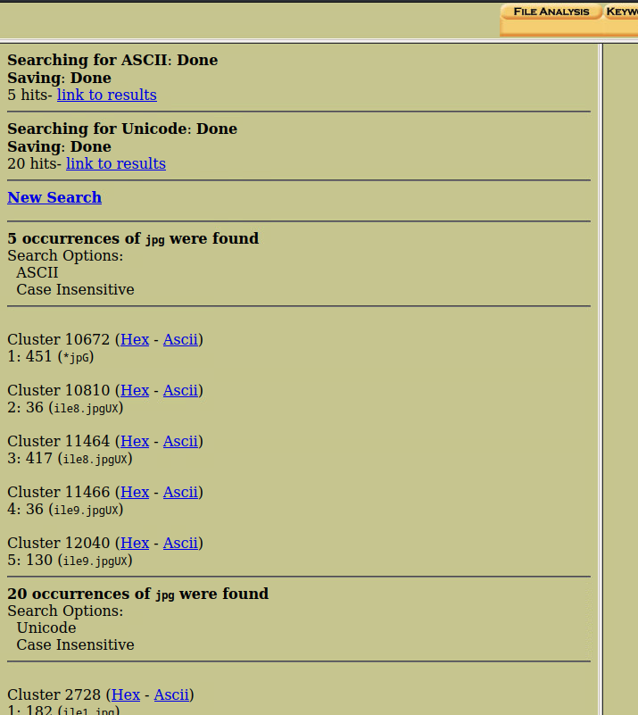
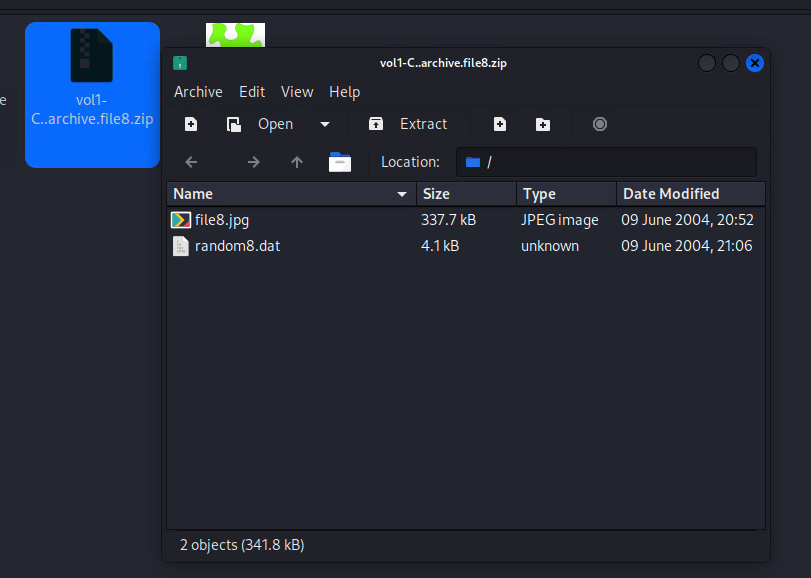
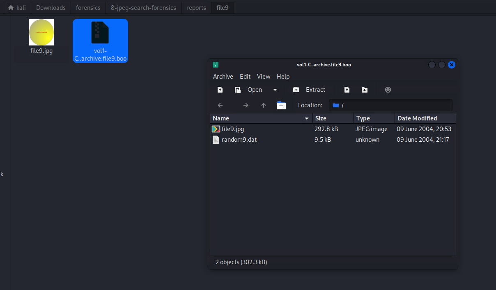
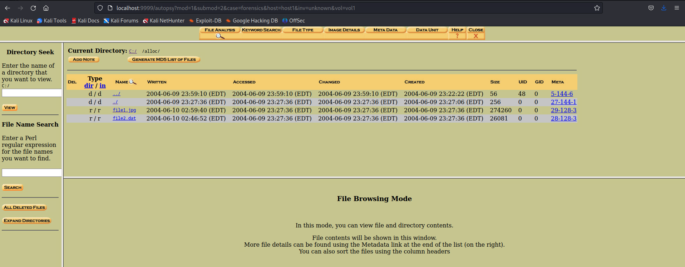
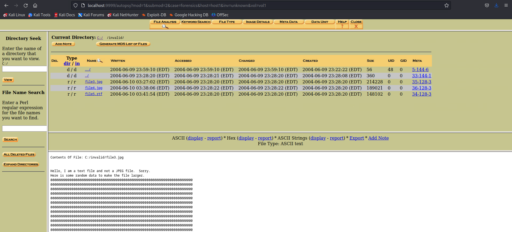

# Forensics, Report & Presentation 

## Technical Scope: 
- Hashing, Autopsy case setup, 
- Autopsy hash verification, 
- Analysis, 
- hidden images discovery and recovery. 

### Tasks: 

1. Generate MD5 hash of an image file, store the hash in a file.
2. Create a new Autopsy case with the image in question, verify the hash with Autopsy. 
3. Verify that the hash in Autopsy matches the original hash taken.
4. Perform file analysis. Search & recover the 5 hidden JPG image files.
5. Analyze findings: explain why these artifacts are significant from a forensic perspective. 
6. Finalize VAPT report.
7. Work on the presentation deck.


## Hashing & Integrity 

####  MD5sum correctly run, hash saved to a file.

``` 
md5sum 8-jpeg-search.dd

# Save hash to evidence file
md5sum 8-jpeg-search.dd > evidence_md5_hash.txt

# Verify against expected value
EXPECTED="9bdb9c76b80e90d155806a1fc7846db5"
```


```
cp 8-jpeg-search.dd 8-jpeg-search-forensic-copy.dd

# Verify copy integrity
md5sum 8-jpeg-search_forensic_copy.dd > copy_md5_hash.txt

```


``` 
diff 8-jpeg-search.dd otro 8-jpeg-search_forensic_copy.dd
```

```
autopsy
```


```
/home/kali/forensics/
├── 8-jpeg-search-forensics/
│   ├── evidence/
│   ├── reports/
│   └── screenshots/
``` 


## Autopsy Case Setup 

#### Case created with correct metadata (case name, description, investigator's name).


#### Forensic image added successfully.


#### Add host


#### Add directory


We are going to use `8-jpeg-search-forensic-copy.dd`, to preserve the integrity of the original image `8-jpeg-search.dd`.


#### Same hash verified in Autopsy.

We should have the same hash that we already calculated before: `9bdb9c76b80e90d155806a1fc7846db5`.


## Evidence Recovery

Analysing the image:


Analyisis succeded:


#### Search for hidden JPG files performed correctly and discovered.

#### Extraction in deleted files

```
All deleted files
>> file6.jpg
>> file7.hmm
```


```
>> - /r C:/del1/file6.jpg
```


Metadata: 


```
>> - /r C:/del1/file7.hmm
```


Metadata:


#### Searching files

Let's search for jpgs:




After checking on the data that was found, we see the following results:

Occurrences of `jpg` were found with search options `ASCII`:

```
1. 451 (*jpg)
>> C:/archive/file10.tar.gz
      Cluster: 10672
      MFT Entry: 38-128-4
2. 36 (ile8.jpgUX)
>> C:/archive/file8.zip
      Cluster: 10810
      MFT Entry: 39-128-3
3. 417 (ile8.jpgUX)
>> C:/archive/file8.zip
      Cluster: 11464
      MFT Entry: 39-128-3
4. 36 (ile9.jpgUX)
>> C:/archive/file9.boo
      Cluster: 11466
      MFT Entry: 40-128-3
5. 130 (ile9.jpgUX)
>> C:/archive/file9.boo
      Cluster: 12040
      MFT Entry: 40-128-3
```

Occurrences of `jpg` were found with search options `Unicode`:

```
1: 182 (ile1.jpg)
>> C://$LogFile
      Cluster: 2728
      MFT Entry: 2728
2. 30 (ile1.jpg)
>> C://$LogFile
      Cluster: 2729
      MFT Entry: 2-128-1
3. 462 (ile6.jpg)
>> C://$LogFile
      Cluster: 2796
      MFT Entry: 2-128-1
4. 310 (ile6.jpg)
>> C://$LogFile
      Cluster: 2797
      MFT Entry: 2-128-1
5. 214 (ile3.jpg)
>> C://$LogFile
      Cluster: 2857
      MFT Entry: 2-128-1
6. 62 (ile3.jpg)
>> C://$LogFile
      Cluster: 2858
      MFT Entry: 2-128-1
7. 198 (ile4.jpg)
>> C://$LogFile 
      Cluster: 2865
      MFT Entry: 2-128-1
8. 46 (ile4.jpg)
>> C://$LogFile
      Cluster: 2866
      MFT Entry: 2-128-1
9. 134 (ile6.jpg)
>> C://$LogFile
      Cluster: 3652
      MFT Entry: 2-128-1
10. 414 (ile1.jpg)
>> C://$MFT
      Cluster: 6753
      MFT Entry: 0-128-1
11. 254 (ile1.jpg)
>> C://$MFT
      Cluster: 6757
      MFT Entry: 0-128-1
12. 414 (ile6.jpg)
>> C://$MFT
      Cluster: 6759
      MFT Entry: 0-128-1
13. 254 (ile6.jpg)
>> C://$MFT
      Cluster: 6763
      MFT Entry: 0-128-1
14. 414 (ile3.jpg)
>> C://$MFT
      Cluster: 6765
      MFT Entry: 0-128-1
15. 6 (e4.jpg)
>> C://$MFT
      Cluster: 6766
      MFT Entry: 0-128-1
16. 254 (ile3.jpg)
>> C://$MFT
      Cluster: 6769
      MFT Entry: 0-128-1
17. 254 (ile4.jpg)
>> C://$MFT
      Cluster: 6771
      MFT Entry: 0-128-1
18. 240 (ict9.jpg)
>> C:/misc/file12.doc
      Cluster: 12583
      MFT Entry: 43-128-3
19. 0 (ict9.jpg)
>> C:/misc/file12.doc
      Cluster: 12818
      MFT Entry: 43-128-3
20. 300 (ile6.jpg)
>> Inode not found
```

This data gives us the idea of looking up on the following directories:

```
>> C: /archive/
>> C://$LogFile
>> C://$MFT
>> C:/misc/
```

and the following files:

```
>> ile1.jpg
>> ile3.jpg
>> ile4.jpg
>> ile6.jpg
>> ile8.jpgUX

>> e4.jpg
>> ict9.jpg

>> C:/archive/file8.zip
>> C:/archive/file9.boo
>> C:/archive/file10.tar.gz

```

This data gave us compressed with hidden images:

```
1. 451 (*jpg) >> C:/archive/file10.tar.gz
2. 36 (ile8.jpgUX) >> C:/archive/file8.zip  
3. 417 (ile8.jpgUX) >> C:/archive/file8.zip
4. 36 (ile9.jpgUX) >> C:/archive/file9.boo
5. 130 (ile9.jpgUX) >> C:/archive/file9.boo
```

Where the attackers are using compressed files (`ZIP`, or `TAR`) to hide images. And the extension `boo` suggests that there is a possible obfuscation. More especifically:

  - `file10.tar.gz`: This containes references to `JPG` files with possible objective files. 
  - `file8.zip`: Appears in multiple clusters and could contain `file.8.jpg`.
  - `file9.boo`: Possible intentional obfuscation.

```
>> C://$LogFile
- ile1.jpg (clusters 2728-2729)
- ile6.jpg (clusters 2796-2797)  
- ile3.jpg (clusters 2857-2858)
- ile4.jpg (clusters 2865-2866)

>> C://$MFT
- ile1.jpg (clusters 6753, 6757)
- ile6.jpg (clusters 6759, 6763)
- ile3.jpg (clusters 6765, 6769)
- ile4.jpg (clusters 6771)
- e4.jpg (cluster 6766)
```
 
Where `$LogFile` is the registery file of `NTFS` that shows operations with files. `MTF`: contains metadata of all files. So, the references in `$LogFile`and `$MFT` indicates that those `JPG` existed in the system and were accessed to or modificated. This will help us to rebuild the timeline of these files. 

Also, 

```
18. 240 (ict9.jpg) >> C:/misc/file12.doc
19. 0 (ict9.jpg) >> C:/misc/file12.doc
```

indicates that `file12.doc` is a Word document that contains references to `file9.jpg`, this could indicate that it has malicious documents with macros that downloads/opens images. 

Finally, the reference

```
20. 300 (ile6.jpg) >> Inode not found
```

Could indicate that the file was deleted, or overwitten, or the file system is corrupted.

So, 
  - `file1.jpg` >> references in `$LogFile` and `$MFT`. 
  - `file3.jpg` >> references in `$LogFile` and `$MFT`. 
  - `file4.jpg` >> references in `$LogFile` and `$MFT`. 
  - `file6.jpg` >> references in `$LogFile` and `$MFT`. 
  - `file8.jpg` >> contained in `file8.zip` and `$MFT`. 
  - `file9.jpg` >> references in `file12.doc`, and contained in `file9.boo`. 
  - `file10.jpg` >> possibly contained in `file10.tar.gz`. 

Possibly existed in the system, but we already found `file6.jpg` in deleted files. We need to look for the others. 

#### Extractionn of compressed files in `C://archive/`

```
>> C://archive/
 - file8.zip
 - file9.boo
 - file10.tar.gz
```


```
>> C://archive/file8.zip
```



```
>> C://archive/file9.boo
```



```
>> C://archive/file10.tar.gz
```


#### Extractionn of compressed files in `C://alloc/`

```
>> C://alloc/
 - file1.jpg
 - file2.dat
```



```
>> C://alloc/file1.jpg
```


```
>> C://alloc/file2.dat
```


#### Extractionn of compressed files in `C://misc/`


```
>> C://misc/
 - file12.doc
 - file13.dll:here
```


```
>> C://misc/file13.dll:here
```


#### Extractionn of compressed files in `C://invalid/`

```
>> C://invalid/
  - file3.jpg
  - file4.jpg
  - file5.rtf
```


```
>> C://invalid/file3.jpg
```



```
>> C://invalid/file4.jpg
```


```
>> C://invalid/file5.rtf
```


#### JPG files recovered.


All the `ASCII` and `Hex` reports may be found in the folder `8-jpeg-search` folder:


```
8-jpeg-search/
├── 8-jpeg-search.dd
├── 8-jpeg-search-forensic-copy.dd
├── COPYING-GNU.txt
├── evidence_md5_hash_copy.txt
├── evidence_md5_hash.txt
└── forensics/
    └── 8-jpeg-search-forensics/
        ├── evidence/
        │   ├── file0.jpg
        │   ├── file8.jpg
        │   ├── file9.jpg
        │   ├── vol1-C..alloc.file1.jpg
        │   ├── vol1-C..alloc.file2.dat
        │   ├── vol1-C..del1.file6.jpg
        │   └── vol1-C..del2.file7.hmm
        └── reports/
            ├── file1/
            │   ├── ASCII-filename=vol1-C..alloc.file1.jpg.txt
            │   ├── Hex-filename=vol1-C..alloc.file1.jpg.txt
            │   ├── vol1-C..archive.file1.jpg
            │   └── vol1-meta29-128-3.raw
            ├── file10/
            │   ├── ASCII-filename=vol1-C..archive.file10.tar.gz.txt
            │   ├── file10.jpg
            │   ├── Hex-filename=vol1-C..archive.file10.tar.gz.txt
            │   └── vol1-C..archive.file10.tar.gz
            ├── files/
            │   ├── ASCII-filename=vol1-C..misc.file13.dll.here.txt
            │   ├── Hex-filename=vol1-C..misc.file13.dll.here.txt
            │   └── vol1-meta44-128-5.raw
            ├── file2/
            │   ├── ASCII-filename=vol1-C..alloc.file2.dat.txt
            │   ├── Hex-filename=vol1-C..alloc.file2.dat.txt
            │   ├── vol1-C..alloc.file2.dat
            │   └── vol1-meta28-128-3.raw
            ├── files/
            │   ├── ASCII-filename=vol1-C..invalid.file3.jpg.txt
            │   ├── Hex-filename=vol1-C..invalid.file3.jpg.txt
            │   └── vol1-meta35-128-3.raw
            ├── file6/
            │   ├── ASCII-filename=vol1-C..invalid.file5.trf.txt
            │   ├── Hex-filename=vol1-C..invalid.file5.trf.txt
            │   └── vol1-meta34-128-3.raw
            ├── file6/
            │   ├── ASCII-filename=vol1-C..vol1-meta-32-128-3.txt
            │   ├── Hex-filename=vol1-C..vol1-meta-32-128-3.txt
            │   ├── vol1-C..del1.file6.jpg
            │   └── vol1-meta32-128-3.raw
            ├── file7/
            │   ├── ASCII-filename=vol1-C..del2.file7.hmm.txt
            │   ├── Hex-filename=vol1-C..del2.file7.hmm.txt
            │   ├── vol1-C..del2.file7.hmm
            │   └── vol1-meta31-128-3.raw
            ├── files/
            │   ├── ASCII-filename=vol1-C..archive.file8.zip.txt
            │   ├── Hex-filename=vol1-C..archive.file8.zip.txt
            │   └── vol1-C..archive.file8.zip
            └── file9/
                ├── ASCII-filename=vol1-C..archive.file9.b00.txt
                ├── Hex-filename=vol1-C..archive.file9.b00.txt
                └── vol1-C..archive.file9.b00
```

#### Findings Summary:

| Files | Origina location | State |
|--------|----------------|------------|
| `file1.jpg` | `C:\alloc\` | Recovered from assigned space | 
| `file2.dat` | `C:\alloc\` | Recovered (extension `dat`) - possible `jpg` renamed|
| `file3.jpg` | `C:\invalid\` | Marked as "invalid" - damaged/corrupted format|
| `file4.jpg`| Not found | Unexistent, overwritten or obfuscated file|
| `file5.trf` | `C:\invalid\` | Extension `.trf` - unknown format |
| `file6.jpg` | `C:\del1\` | Recovered from deleted space|
| `file7.hmm` | `C:\del2\` | Recovered (extension`hmm`) - unknown format |
| `file8.zip` | `C:\archive\` | Contains `file8.jpg` |
| `file9.boo` | `C:\archive\` | Contains `file9.jpg` (obfuscated extension) |
| `file10.tar.gz` | `C:\archive\` | Contains `file10.jpg` |
| `file13.dll.here` | `C:\misc\` | Suspicious `dll` file - suspicious executable file|


