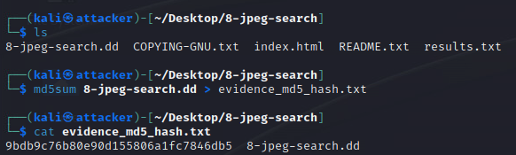
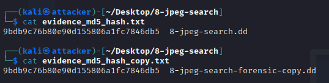
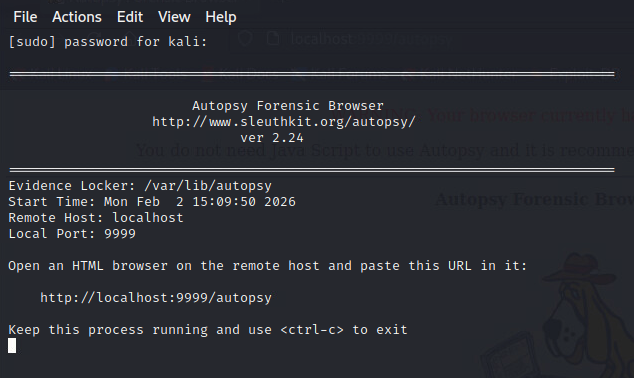
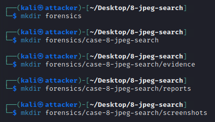
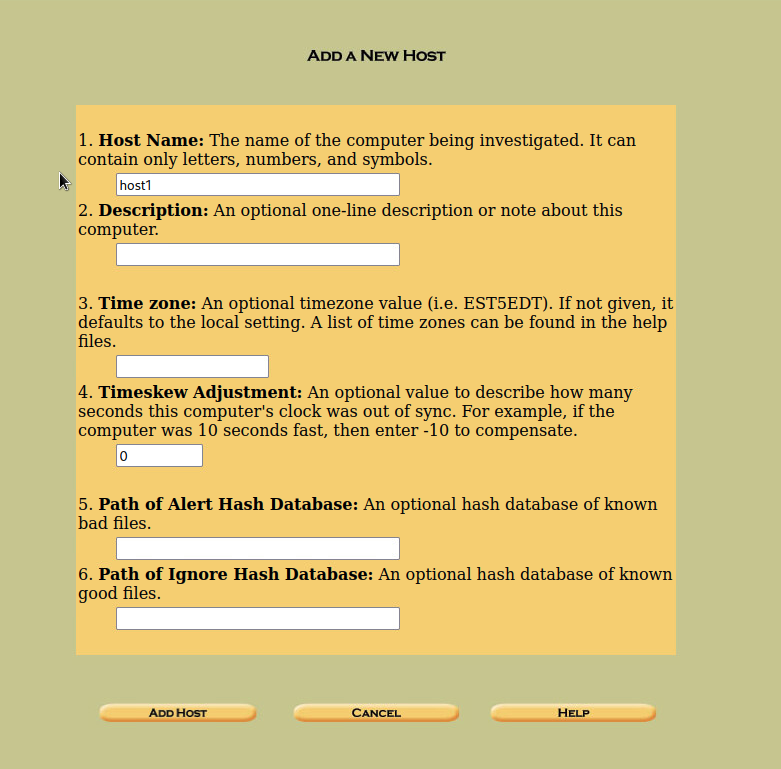
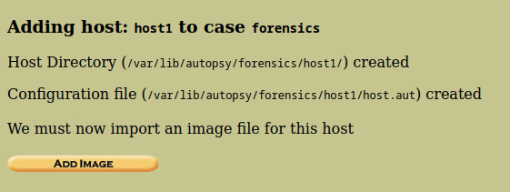
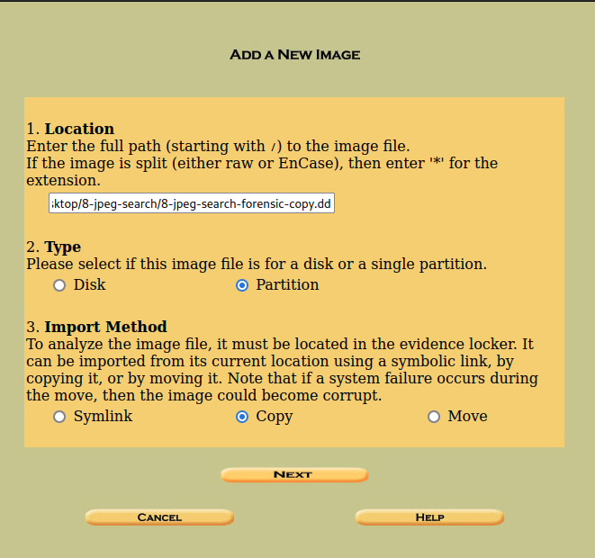
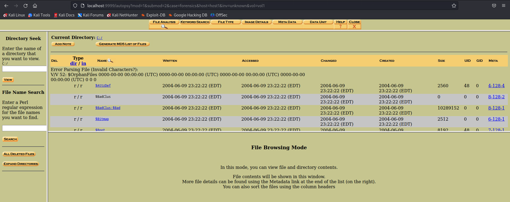
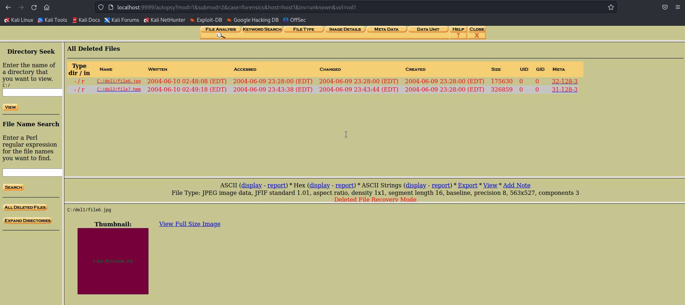

# Forensics, Report & Presentation 

## Technical Scope: 
- Hashing, Autopsy case setup, 
- Autopsy hash verification, 
- Analysis, 
- hidden images discovery and recovery. 

### Tasks: 

1. Generate MD5 hash of an image file, store the hash in a file.
2. Create a new Autopsy case with the image in question, verify the hash with Autopsy. 
3. Verify that the hash in Autopsy matches the original hash taken.
4. Perform file analysis. Search & recover the 5 hidden JPG image files.
5. Analyze findings: explain why these artifacts are significant from a forensic perspective. 
6. Finalize VAPT report.
7. Work on the presentation deck.


## Hashing & Integrity 

####  MD5sum correctly run, hash saved to a file.

``` 
md5sum 8-jpeg-search.dd

# Save hash to evidence file
md5sum 8-jpeg-search.dd > evidence_md5_hash.txt

# Verify against expected value
EXPECTED="9bdb9c76b80e90d155806a1fc7846db5"
```



```
cp 8-jpeg-search.dd 8-jpeg-search-forensic-copy.dd

# Verify copy integrity
md5sum 8-jpeg-search_forensic_copy.dd > copy_md5_hash.txt

```



``` 
diff 8-jpeg-search.dd otro 8-jpeg-search_forensic_copy.dd
```

```
autopsy
```




```
/home/kali/forensics/
├── 8-jpeg-search-forensics/
│   ├── evidence/
│   ├── reports/
│   └── screenshots/
``` 




## Autopsy Case Setup 

#### Case created with correct metadata (case name, description, investigator's name).


#### Forensic image added successfully.


#### Add host





#### Add directory


We are going to use `8-jpeg-search-forensic-copy.dd`, to preserve the integrity of the original image `8-jpeg-search.dd`.



#### Same hash verified in Autopsy.

We should have the same hash that we already calculated before: `9bdb9c76b80e90d155806a1fc7846db5`.


## Evidence Recovery

Analysing the image:


Analyisis succeded:



#### Search for hidden JPG files performed correctly and discovered.

In deleted files: 

```
All deleted files
>> file6.jpg
>> file7.hmm
```


```
>> - /r C:/del1/file6.jpg
```



Metadata: 


```
>> - /r C:/del1/file7.hmm
```


Metadata:


```
```


```
```


```
```


####  5 valid JPG files recovered.

#### Screenshots included.

## Analysis & Documentation 

#### Findings explain the significance of recovered evidence.

#### Notes investigative relevance (Ex: hidden images implying attempt to conceal evidence).


## Final Report & Presentation Deck 

#### VAPT report completed and submitted, aligning with VAPT template.

#### Presentation deck created (10–12 slides).


